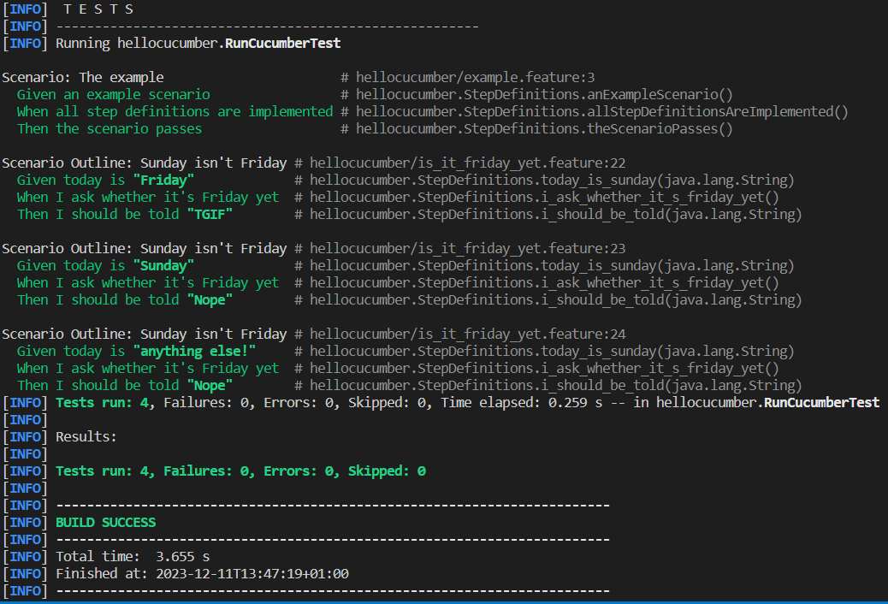
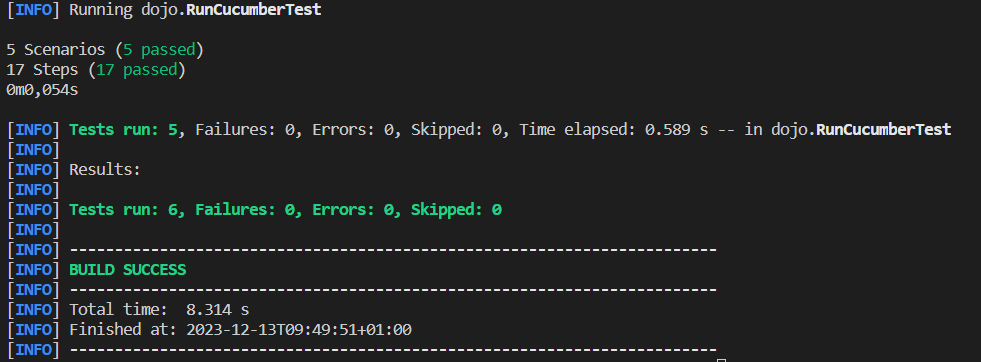
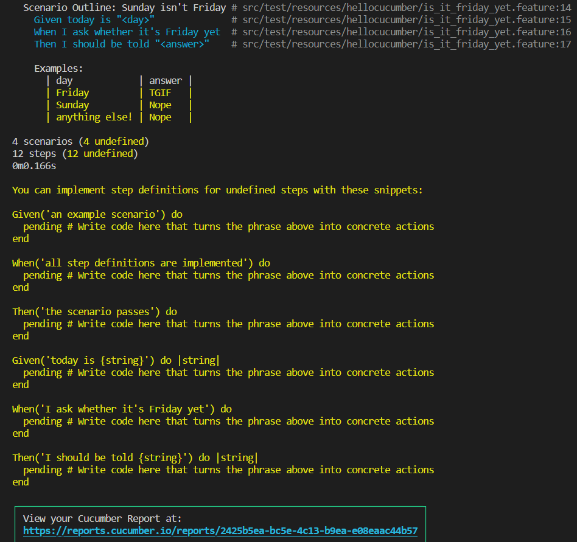
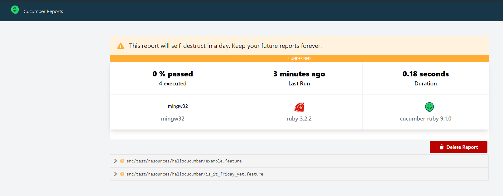
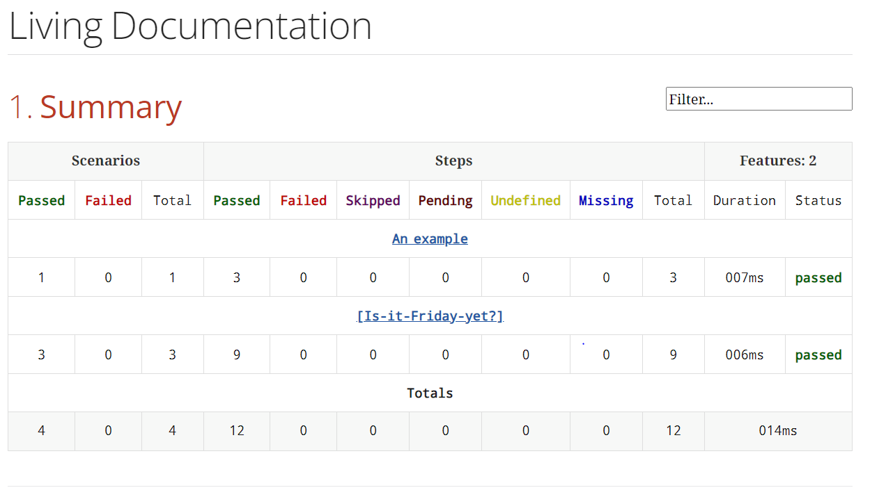
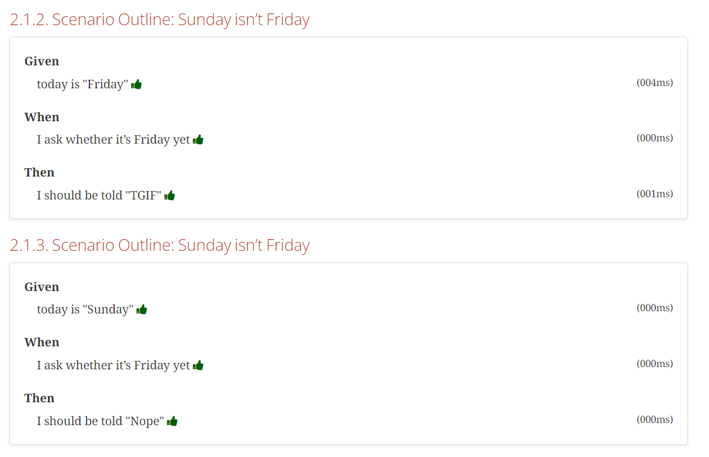
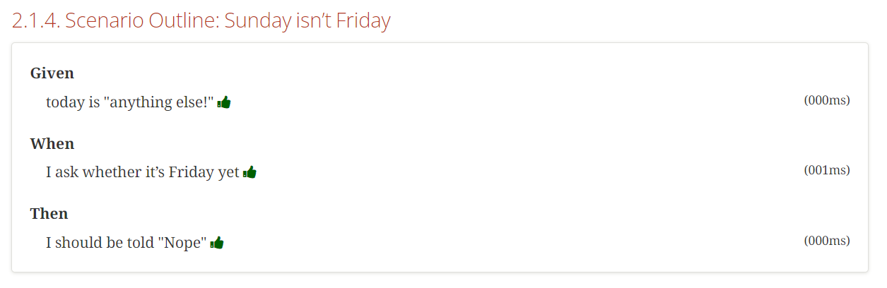

= R5.A.08 -- Dépôt pour les TPs
:icons: font
:MoSCoW: https://fr.wikipedia.org/wiki/M%C3%A9thode_MoSCoW[MoSCoW]

Ce dépôt concerne les rendus de Baptiste : baptiste.besson@etu.univ-tlse2.fr [Baptiste Besson].

== TP1

Feature: Is it Friday yet?

  Scenario Outline: Sunday isn't Friday
    Given today is "<day>"
    When I ask whether it's Friday yet
    Then I should be told "<answer>"

    
    Examples:
        | day            | answer |
        | Friday         | TGIF   |
        | Sunday         | Nope   |
        | anything else! | Nope   |

== TP2...
fichier Order.java :

public class Order {
    private String owner;
    
    private String target;

    private List<String> cocktails = new ArrayList<String>();

    private String message;

    public void declareOwner(String owner) {
        this.owner = owner;
    }

    public void declareTarget(String target) {
        this.target = target;
    }

    public List<String> getCocktails() {
        return this.cocktails;
    }

    public void setMessage(String message) {
        this.message = message;
    }

    public String getMessage() {
        return "From " + this.owner + " to " + this.target + ": " + this.message;
    }
}

== TP3...

== TP4...

Documentation améliorée (cucumber en ligne de commande) :

Documentation améliorée (cukedoctor) :

